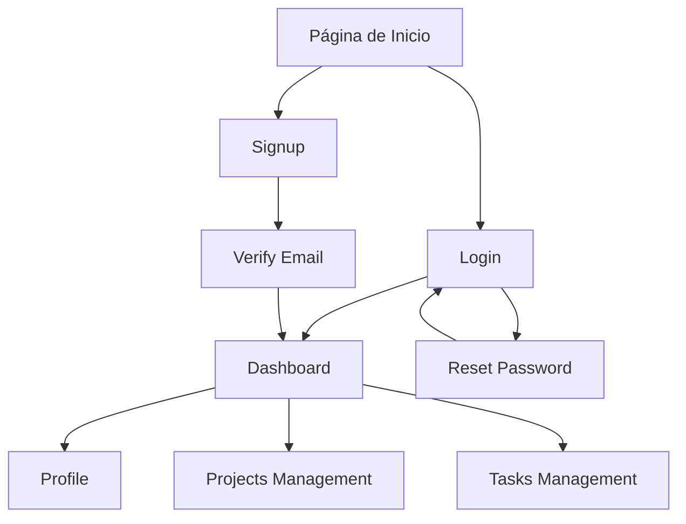

# Requisitos de Despliegue Docker - Simple PHP Web Application

## 1. Descripción General del Proyecto

**Simple PHP Web Application Starter** es una aplicación web PHP completa que proporciona funcionalidades básicas de autenticación de usuarios, gestión de perfiles y dashboard administrativo. La aplicación está diseñada para ser un punto de partida sólido para desarrolladores que buscan implementar rápidamente una aplicación web con funcionalidades de usuario estándar.

- **Objetivo Principal**: Dockerizar la aplicación PHP existente para facilitar el despliegue y la portabilidad, manteniendo la conectividad con un servidor de base de datos MySQL externo ubicado en la IP 192.168.23.136.
- **Valor del Producto**: Proporcionar un entorno de desarrollo y producción consistente y reproducible que elimine las dependencias del sistema host y simplifique el proceso de despliegue.

## 2. Funcionalidades Principales

### 2.1 Roles de Usuario

| Rol | Método de Registro | Permisos Principales |
|-----|-------------------|---------------------|
| Usuario Registrado | Registro por email con verificación | Acceso completo al dashboard, gestión de perfil, creación de proyectos y tareas |
| Usuario No Verificado | Registro inicial sin verificar email | Acceso limitado hasta completar verificación por email |

### 2.2 Módulos de Funcionalidad

La aplicación dockerizada consistirá en los siguientes componentes principales:

1. **Página de Inicio de Sesión**: autenticación de usuarios, recuperación de contraseña
2. **Página de Registro**: creación de cuenta, verificación por email
3. **Dashboard Principal**: resumen de proyectos, tareas pendientes, notificaciones
4. **Gestión de Perfil**: edición de información personal, cambio de contraseña
5. **Gestión de Proyectos**: creación, edición y seguimiento de proyectos
6. **Gestión de Tareas**: asignación y seguimiento de tareas por proyecto

### 2.3 Detalles de Páginas

| Página | Módulo | Descripción de Funcionalidad |
|--------|--------|------------------------------|
| Login | Autenticación | Validar credenciales, iniciar sesión segura, redirección post-login |
| Signup | Registro | Crear cuenta nueva, validación de datos, envío de email de verificación |
| Dashboard | Panel Principal | Mostrar resumen de actividad, proyectos activos, tareas pendientes, notificaciones |
| Profile | Gestión de Perfil | Editar información personal, cambiar contraseña, gestionar configuraciones |
| Verify | Verificación | Confirmar email de registro, activar cuenta de usuario |
| Reset Password | Recuperación | Solicitar y procesar restablecimiento de contraseña |

## 3. Flujo Principal de Usuario

**Flujo de Usuario Nuevo:**
1. Usuario accede a la página de registro
2. Completa formulario de registro con datos personales
3. Sistema envía email de verificación
4. Usuario confirma email y activa cuenta
5. Accede al dashboard principal
6. Puede crear proyectos y gestionar tareas

**Flujo de Usuario Existente:**
1. Usuario accede a página de login
2. Ingresa credenciales
3. Sistema valida y redirige al dashboard
4. Usuario gestiona proyectos, tareas y perfil

## 4. Especificaciones de Diseño de Interfaz

### 4.1 Estilo de Diseño

- **Colores Primarios**: Azul (#007bff), Gris (#6c757d)
- **Colores Secundarios**: Verde (#28a745) para éxito, Rojo (#dc3545) para errores
- **Estilo de Botones**: Botones redondeados con efectos hover
- **Tipografía**: Sans-serif, tamaños 14px-18px para contenido, 24px-32px para títulos
- **Layout**: Diseño basado en cards con navegación superior fija
- **Iconografía**: Iconos minimalistas para acciones principales

### 4.2 Resumen de Diseño por Página

| Página | Módulo | Elementos de UI |
|--------|--------|-----------------|
| Login | Formulario de Acceso | Card centrado, campos de email/password, botón de acceso, enlaces a registro y recuperación |
| Dashboard | Panel Principal | Header con navegación, sidebar con menú, cards de resumen, tablas de datos |
| Profile | Gestión de Perfil | Formulario de edición, avatar de usuario, tabs para diferentes secciones |

### 4.3 Responsividad

La aplicación está diseñada con enfoque mobile-first y se adapta a diferentes tamaños de pantalla:
- **Desktop**: Layout completo con sidebar y múltiples columnas
- **Tablet**: Layout adaptado con navegación colapsable
- **Mobile**: Layout de una columna con navegación tipo hamburger