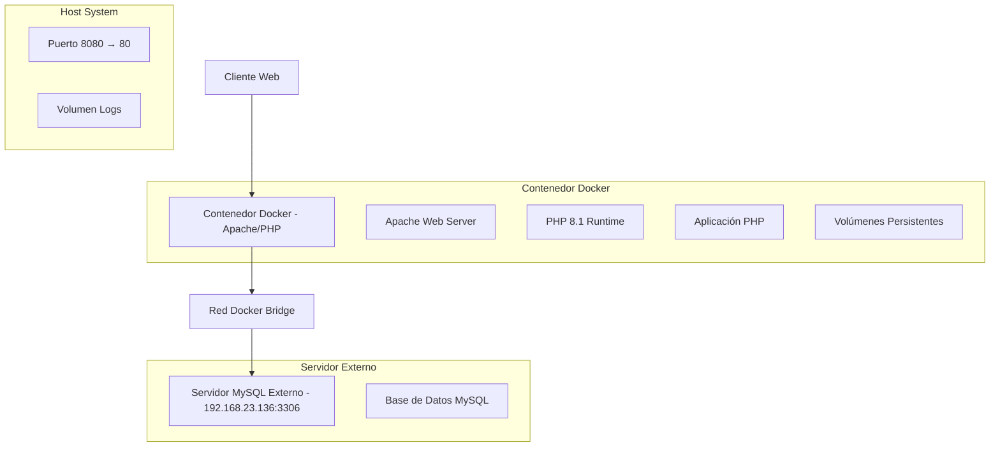
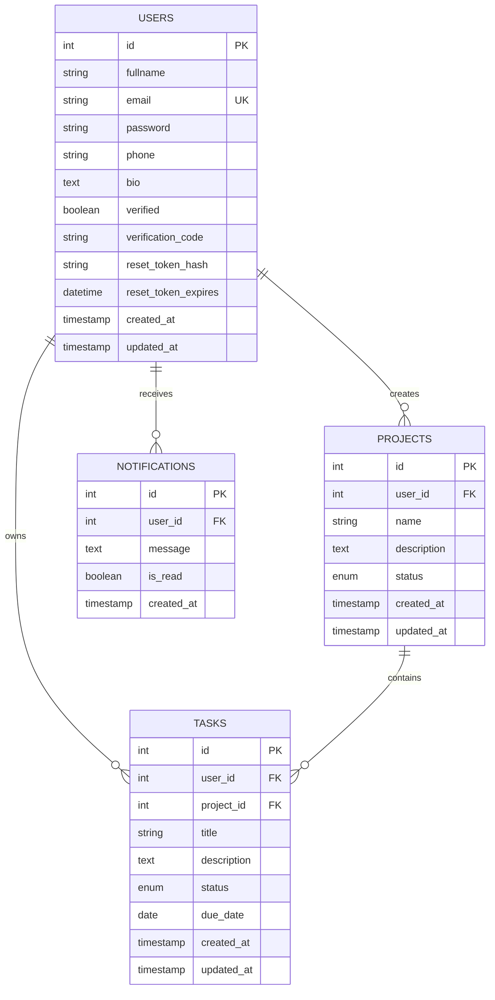

# Arquitectura Técnica Docker - Simple PHP Web Application

## 1. Diseño de Arquitectura



## 2. Descripción de Tecnologías

- **Contenedor Base**: php:8.1-apache (imagen oficial optimizada)
- **Servidor Web**: Apache HTTP Server 2.4 (incluido en imagen base)
- **Runtime PHP**: PHP 8.1 con extensiones mysqli, pdo_mysql
- **Base de Datos**: MySQL 5.7+ (servidor externo en 192.168.23.136)
- **Orquestación**: Docker Engine con docker-compose (opcional)

## 3. Definiciones de Rutas

| Ruta | Propósito |
|------|-----------|
| / | Página principal, redirige a login si no autenticado |
| /login.php | Página de inicio de sesión |
| /signup.php | Página de registro de usuarios |
| /dashboard.php | Panel principal del usuario autenticado |
| /profile.php | Gestión de perfil de usuario |
| /verify.php | Verificación de email de registro |
| /reset-password.php | Restablecimiento de contraseña |
| /logout.php | Cierre de sesión y limpieza |

## 4. Configuración de Contenedor Docker

### 4.1 Dockerfile Optimizado

```dockerfile
FROM php:8.1-apache

# Instalar extensiones PHP necesarias
RUN docker-php-ext-install mysqli pdo pdo_mysql

# Habilitar mod_rewrite de Apache
RUN a2enmod rewrite

# Configurar directorio de trabajo
WORKDIR /var/www/html

# Copiar código fuente
COPY . /var/www/html/

# Configurar permisos
RUN chown -R www-data:www-data /var/www/html \
    && chmod -R 755 /var/www/html

# Crear directorio de logs con permisos
RUN mkdir -p /var/www/html/logs \
    && chown -R www-data:www-data /var/www/html/logs \
    && chmod -R 777 /var/www/html/logs

# Exponer puerto 80
EXPOSE 80

# Comando por defecto
CMD ["apache2-foreground"]
```

### 4.2 Variables de Entorno

| Variable | Descripción | Valor por Defecto |
|----------|-------------|-------------------|
| DB_HOST | Dirección IP del servidor MySQL | 192.168.23.136 |
| DB_PORT | Puerto del servidor MySQL | 3306 |
| DB_NAME | Nombre de la base de datos | webapp_db |
| DB_USER | Usuario de la base de datos | webapp_user |
| DB_PASS | Contraseña de la base de datos | (requerida) |
| APP_URL | URL base de la aplicación | http://localhost:8080 |
| CSRF_SECRET | Clave secreta para tokens CSRF | (generada automáticamente) |

### 4.3 Comandos de Construcción y Ejecución

**Construcción de la imagen:**
```bash
docker build -t php-webapp:latest .
```

**Ejecución del contenedor:**
```bash
docker run -d \
  --name php-webapp-container \
  -p 8080:80 \
  -e DB_HOST=192.168.23.136 \
  -e DB_PORT=3306 \
  -e DB_NAME=webapp_db \
  -e DB_USER=webapp_user \
  -e DB_PASS=your_password \
  -e APP_URL=http://localhost:8080 \
  -v $(pwd)/logs:/var/www/html/logs \
  --add-host=database:192.168.23.136 \
  php-webapp:latest
```

## 5. Configuración de Red y Conectividad

### 5.1 Configuración de Red Docker

```bash
# Crear red personalizada para mejor conectividad
docker network create --driver bridge webapp-network

# Ejecutar contenedor en red personalizada
docker run -d \
  --name php-webapp-container \
  --network webapp-network \
  -p 8080:80 \
  [otras opciones...]
  php-webapp:latest
```

### 5.2 Verificación de Conectividad

```bash
# Verificar conectividad con el servidor MySQL
docker exec -it php-webapp-container ping 192.168.23.136

# Probar conexión MySQL desde el contenedor
docker exec -it php-webapp-container \
  mysql -h 192.168.23.136 -u webapp_user -p webapp_db
```

## 6. Modelo de Datos

### 6.1 Definición del Modelo de Datos



### 6.2 Script de Inicialización de Base de Datos

```sql
-- Crear base de datos
CREATE DATABASE IF NOT EXISTS webapp_db CHARACTER SET utf8mb4 COLLATE utf8mb4_unicode_ci;
USE webapp_db;

-- Crear usuario para la aplicación
CREATE USER IF NOT EXISTS 'webapp_user'@'%' IDENTIFIED BY 'your_secure_password';
GRANT ALL PRIVILEGES ON webapp_db.* TO 'webapp_user'@'%';
FLUSH PRIVILEGES;

-- Crear tablas (usar schema.sql existente)
SOURCE /path/to/schema.sql;
```

## 7. Configuración de Volúmenes y Persistencia

### 7.1 Volúmenes Requeridos

| Volumen | Propósito | Ruta en Contenedor | Ruta en Host |
|---------|-----------|-------------------|--------------|
| Logs | Almacenar logs de aplicación | /var/www/html/logs | ./logs |
| Uploads | Archivos subidos por usuarios | /var/www/html/uploads | ./uploads |

### 7.2 Docker Compose (Opcional)

```yaml
version: '3.8'
services:
  webapp:
    build: .
    container_name: php-webapp
    ports:
      - "8080:80"
    environment:
      - DB_HOST=192.168.23.136
      - DB_PORT=3306
      - DB_NAME=webapp_db
      - DB_USER=webapp_user
      - DB_PASS=${DB_PASSWORD}
      - APP_URL=http://localhost:8080
    volumes:
      - ./logs:/var/www/html/logs
      - ./uploads:/var/www/html/uploads
    extra_hosts:
      - "database:192.168.23.136"
    restart: unless-stopped
```

## 8. Monitoreo y Logs

### 8.1 Configuración de Logs

- **Logs de Apache**: Disponibles en `/var/log/apache2/` dentro del contenedor
- **Logs de Aplicación**: Almacenados en `/var/www/html/logs/` (volumen persistente)
- **Logs de PHP**: Configurados para escribir en logs de aplicación

### 8.2 Comandos de Monitoreo

```bash
# Ver logs en tiempo real
docker logs -f php-webapp-container

# Acceder a logs de aplicación
docker exec -it php-webapp-container tail -f /var/www/html/logs/error.log

# Verificar estado del contenedor
docker stats php-webapp-container
```